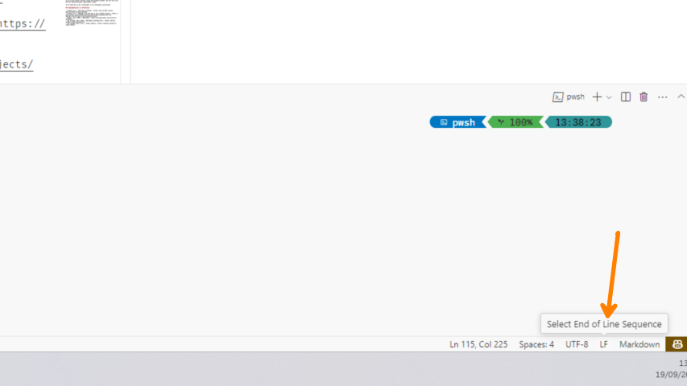

# Git versiebeheer

Voor het bijhouden van broncode is een versiebeheersysteem onontbeerlijk geworden. Git, dat ontwikkeld werd door Linux Torvalds, is een van de meest gebruikte geworden. Het is intussen niet alleen ingeburgerd bij software-ontwikkelaars wereldwijd, ook voor systeembeheerders is het een onmisbare tool geworden. Élke ict-professional zou dus met Git moeten kunnen werken.

In dit document vind je enkele aanwijzingen om Git vanop de command-line (CLI) te gebruiken. Deze instructies werken zowel op Windows (in de Git Bash shell, meegeleverd met de Git client) als op MacOS en Linux.

## Start to GIT (op de CLI)

We gaan de volgende labo-taken bijhouden in een *versiebeheersysteem*. Dat omvat alle scripts en de exacte configuratie van de opgezette systemen, maar ook je documentatie (zoals procedures, "cheat sheets", "checklists", enz.).

We gaan er vanuit dat je al een Github-account hebt. Indien niet, maak er zelf een aan. Zorg ook dat je HOGENT-emailadres (@student.hogent.be) toegevoegd is aan je Github-account (surf naar <https://github.com/> en log in, klik rechtsboven op je avatar en ga naar Settings > Emails).

Voor de volgende stappen werk je in jouw Linux (GUI) VM. Je kan deze herhalen op je fysieke systeem om ook daar vlot met Git te kunnen werken.

1. Je kan het inloggen met gebruikersnaam en wachtwoord vereenvoudigen door een [SSH-sleutelpaar](https://docs.github.com/en/authentication/connecting-to-github-with-ssh/adding-a-new-ssh-key-to-your-github-account) aan te maken. Maak zo'n sleutelpaar aan in de terminal (voor je gemak: zonder passphrase) en registreer de publieke sleutel bij Github. Gebruik het commando `ssh-keygen` en blijf ENTER drukken totdat je opnieuw de Bash-prompt ziet.

    ```console
    $ ssh-keygen -C "voornaam.naam@student.hogent.be"
    Generating public/private rsa key pair.
    Enter file in which to save the key (/home/bert/.ssh/id_rsa):
    Enter passphrase (empty for no passphrase):
    Enter same passphrase again:
    Your identification has been saved in id_rsa.
    Your public key has been saved in id_rsa.pub.
    The key fingerprint is:
    SHA256:AzAeA7KrzKUg6V4IVGTtvQf7GhY/a8vtLB8ck46TbOM bert@DESKTOP-Q690SE3
    The key's randomart image is:
    +---[RSA 2048]----+
    |. o=*            |
    | oo. *           |
    |..  o o          |
    |.o   . +    .    |
    |*  .   .S  +     |
    |O +    o+o= o    |
    |.* .   ooX +     |
    |. .   . =+B .    |
    | .     .oE==     |
    +----[SHA256]-----+
    $
    ```

    De inhoud van het tekstbestand `~/.ssh/id_rsa.pub` kan je kopiëren en plakken in je Github-instellingen (Settings > SSH and GPG keys).

    Maak een apart sleutelpaar aan op elke machine (VM of fysiek) waar je met Git werkt. Je kan meerdere publieke sleutels registreren in Github.

2. Open in de VM een webbrowser en ga naar de Github classroom (URL via Chamilo gepubliceerd) en klik door op "Accept this assignment". Je kan daarna doorklikken naar een repository die enkel voor jou en de lector toegankelijk is, waar startcode en de informatie over de opgaven gepubliceerd zijn.

3. Als je op een bepaalde machine nog nooit Git gebruikt hebt vanop de command-line, dan is het belangrijk om volgende basisinstellingen aan te passen. Voer de hieronder opgesomde commando's uit in een terminal. Als emailadres gebruik je je @student.hogent.be-adres.

    ```bash
    git config --global user.name "VOORNAAM NAAM"
    git config --global user.email "VOORNAAM.NAAM@student.hogent.be"
    git config --global push.default simple
    ```

    De volgende instellingen zijn ook nuttig:

    ```bash
    # Vermijd merge-commits, behoud eenvoudige, lineaire historiek
    git config --global pull.rebase true
    # Als je tijdens git pull nog lokale wijzigingen hebt
    # kan je deze even opzij zetten met autostash
    git config --global rebase.autostash true
    # Optioneel, stel je Github-gebruikersnaam in
    git config --global github.user GITHUB_USERNAME
    # Enkel op Windows belangrijk, vermijd problemen met regeleindes
    git config --global core.autocrlf input
    # Als je zelf repositories zou aanmaken (met `git init`)
    git config --global init.defaultbranch main
    ```

4. Maak binnen de VM een directory die je voorbehoudt voor al wat met deze cursus te maken heeft. Kopieer de URL van je persoonlijke Github-repo via de groene knop rechtsboven met "Code". Kies "Use SSH" en kopieer de URL in het tekstvak eronder. In de terminal ga je naar de directory waarbinnen je al je materiaal in verband met deze cursus wil bijhouden en voert volgend commando uit:

    ```console
    $ git clone git@github.org:hogenttin/REPONAAM.git
    ```

    Je kan de naam van de lokale directory wijzigen of de directory verplaatsen zonder de link naar Github kwijt te spelen!

5. Bekijk de inhoud van je lokale kopie van de repository. Daar vind je een aantal bestanden in [Markdown](http://daringfireball.net/projects/markdown/)-formaat. Het bestand `cheat-sheet.md` dient om in de loop van het semester nuttige commando's en troubleshooting checklists bij te houden. Zie <https://github.com/bertvv/cheat-sheets> voor enkele voorbeelden.

6. Pas deze sheet aan: vul je naam en repository-url in op de daarvoor voorziene plaats. Welke commando's leerde je al in de voorbije labo's? Registreer de wijziging in Git (`git add` en `git commit`) en hevel die over naar Github (`git push`).

Ook bij volgende labo's wordt een dergelijke gestructureerde manier van werken met GIT zeer zeker aanbevolen. Dankzij Git kan je je labo-nota's binnen de VM en op je fysieke systeem synchroniseren en heb je ook altijd een backup in de cloud.

## Eenvoudige Git workflow

Voor wie nog niet vertrouwd is met het werken met Git, volgen hier de belangrijkste commando's. Merk op, we werken hier niet met branches, dus daar hoef je je nog geen zorgen over te maken.

1. Gebruik een teksteditor om wijzigingen te maken in bestanden binnen je lokale kopie van je repository. Open een terminal, ga naar de directory met je code en voer `git status` uit om een overzicht te krijgen van alle lokale wijzigingen.
2. Gebruik `git add BESTANDEN` om alle bestanden aan te duiden waarvan je de lokale wijzigingen wil registreren. Als je in één keer alle gewijzigde bestanden wil aanduiden, gebruik je `git add .` (de punt staat voor de huidige directory en alle directories eronder).
3. Met `git commit -m "Beschrijving van de wijzigingen"` leg je de wijzigingen vast. Doe de moeite om beschrijvende commit-boodschappen op te geven!
4. Met `git push` stuur je de zopas lokaal geregistreerde wijzigingen naar Github.

**Telkens je stopt met werken voor dit vak commit je alle wijzigingen en kopieert ze naar Github!**

Je kan tussen elke stap `git status` uitvoeren om te verifiëren wat er gebeurd is. De uitvoer van `git status` geeft vaak ook het commando dat nodig is om de laatste stap ongedaan te maken.

Als je meerdere lokale kopieën hebt van je Github-repository (bv. in de VM en op je fysieke systeem), dan moet je voordat je begint te werken eventuele wijzigingen die op Github staan binnen te halen. Dat kan met `git pull`. Als je de aanbeveling van hierboven ivm basisconfiguratie *niet* gevolgd hebt, dan doe je best altijd `git pull --rebase`. Daarmee kan je vermijden dat je historiek onoverzichtelijk wordt.

Je kan eventueel een Git GUI gebruiken (zoals Gitkraken), maar soms is dat niet mogelijk (op een server zonder grafische omgeving, bijvoorbeeld), dus het is sowieso nuttig om Git op de CLI te leren gebruiken.

## Nota's nemen met Markdown

Een versiebeheersysteem is geoptimaliseerd om te werken met *tekstbestanden.* Het is niet in staat om op een efficiënte manier om te gaan met binaire bestanden. **Hou dan ook geen nota's bij in Word.** Er zijn nog andere redenen om dat niet te doen. Broncode in een Word-document zal vaak niet werken als je deze in de console kopieert. Aanhalingstekens zijn bijvoorbeeld omgezet in zgn. *smart quotes* (“”), het "minteken" (*[hyphen](https://www.thepunctuationguide.com/hyphen.html)*) wordt ook vaak in een ander symbool omgezet (*[en-dash](https://www.thepunctuationguide.com/en-dash.html)*), enz. Als je code in een Word-document plakt, zal het ook niet mooi opgemaakt zijn zoals je in een IDE of code-editor gewend bent. In plaats daarvan krijg je een lelijk lettertype (Calibri of het oudere Times New Roman) dat hoegenaamd niet geschikt is om code te tonen (variabele letterbreedte, geen syntaxkleuren, geen indentatie van te lange regels, enz.).

Op Github is het standaard-bestandsformaat voor opgemaakte tekst Markdown. Het is een tekstformaat met enkele eenvoudige regels om opmaak te markeren. Als je op Github een Markdown-bestand opent, wordt het omgezet in HTML. Codefragmenten kunnen getoond worden met syntaxkleuren. Neem de [documentatie op Github](https://docs.github.com/en/get-started/writing-on-github) door om het te leren kennen.

**Wij raden heel sterk aan om te leren nota's te nemen in Markdown.** Markdown wordt meer en meer gebruikt en komt ook nog in latere cursussen van pas. Jupyter Notebooks, bijvoorbeeld, (gebruikt in o.a. Data Science & AI en andere vakken uit de Data Engineering-leerlijn) zijn documenten die deels bestaan uit Python-code en Markdown. Er zijn tegenwoordig ook tientallen tools om Markdown om te zetten in een veelvoud van formaten: presentaties, websites, PDFs, enz. Markdown is echt niet moeilijk en het is een nuttige vaardigheid.

## Regeleindes van tekstbestanden

Een belangrijk verschil tussen Windows enerzijds en Linux/macOS anderzijds is de manier waarop regeleindes in tekstbestanden worden voorgesteld.

Op een Linux-systeem bestaat een regeleinde uit 1 byte: `\n`, of ASCII-symbool 10 (Line Feed/LF). Op een Windows-systeem, echter worden 2 bytes gebruikt: `\r\n`, of ASCII-karakters 13 en 10 (Carriage Return/CR + Line Feed/LF).

De namen "Carriage Return" en "Line Feed" komen van vroegere printers die enkel tekst konden afdrukken. "Line Feed" was het commando om het papier één regel op te schuiven en "Carriage Return" om de printkop terug naar het begin van de regel te bewegen.

Het is belangrijk op op te letten dat bestanden altijd de correcte regeleindes hebben. In het bijzonder **moeten** Shell-scripts **altijd** Linux-regeleindes hebben, zoniet zal het script niet uitvoeren:

```console
$ ./hello.sh
-bash: ./hello.sh: /bin/bash^M: bad interpreter: No such file or directory
```

De `^M` is een aanduiding voor dat CR-karakter.

In deze repository zit een vorm van bescherming via het bestand [.gitattributes](.gitattributes). Die bepaalt o.a. dat bestanden met extensie `.sh` die gecommit worden altijd Linux-regeleindes krijgen. Als je je script echter schrijft vanop een Windows-systeem, kan het toch zijn dat het bestand Windows-regeleindes krijgt.

In VS Code kan je dit rechtsonder in de statusbalk controleren. 



Staat er LF? Dan is alles ok! Staat er CRLF? Dan klik je er op en kan je het juiste soort regeleindes kiezen.

In Git Bash en op Linux-systemen bestaat er ook een commando `dos2unix` waarmee je tekstbestanden kan omzetten.

## Studiemateriaal en referenties

- Github (n.d.). *Writing on GitHub*. <https://docs.github.com/en/get-started/writing-on-github>
- Github (n.d.). *Adding a new SSH key to your GitHub account*. <https://docs.github.com/en/authentication/connecting-to-github-with-ssh/adding-a-new-ssh-key-to-your-github-account>
- Gruber, John (2004). *Markdown*. <http://daringfireball.net/projects/markdown/>
- Van Vreckem, Bert (2014). *Workshop Inleiding Git*, <https://bertvv.github.io/git-workshop-nl/>
- Van Vreckem, Bert (n.d.). *Cheat Sheets*, <https://github.com/bertvv/cheat-sheets> 
